#  Zigbee Stack porting for 3rd party MCU Quick-Start Guide
##  Description

This quick-start guide provides basic information on configuring, building, debugging and installing Zigbee applications for STM32F4 family (STM32F411 available now) in both ways using Simplicity Studio 5 and non-Simplicity Studio 5.
This guide is designed for developers who want to use 3rd platform (MCU, IDE, compiler) with Zigbee stack from Silicon Labs’ chip (at the time this guide is written, we only support STM32F411 with GCC compiler on STM32CubeIDE)

##  Gecko SDK version

GSDK ver 4.1.1 and higher

##  Hardware Required

• [NUCLEO-F411RE board](https://www.st.com/en/evaluation-tools/nucleo-f411re.html )
• [EFR32MG12 Starter Kit](https://www.st.com/en/evaluation-tools/nucleo-f411re.html )

##  Connections Required
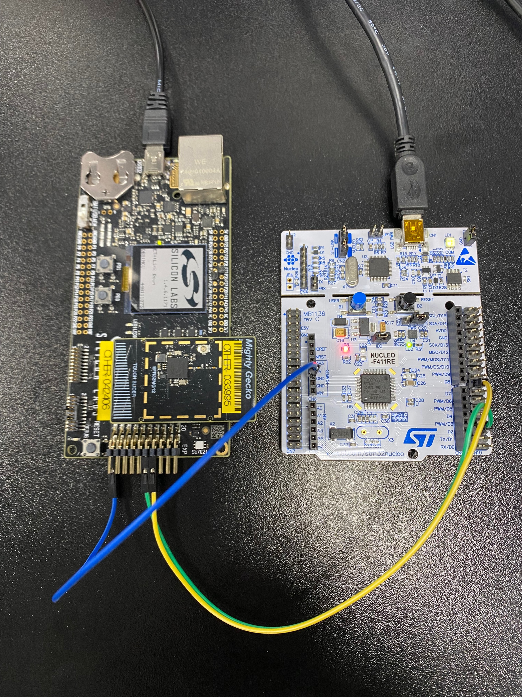

Connect these pins:

| Connection | EXP Header Silabs Board | NUCLEO-F411RE                   |
| ---------- | ----------------------- | ------------------------------- |
| UART_TX    | PIN12 - UART_TX/PA05    | CN10 - UART1_RX / CN9 - PA10/D2 |
| UART_RX    | PIN14 - UART_RX/PA06    | CN10 - UART1_TX / CN9 - PA9/D8  |
| Ground     | PIN1 - GND              | CN6 - GND                       |

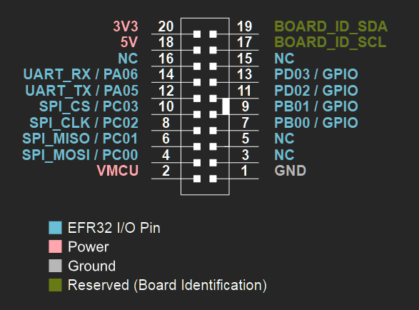
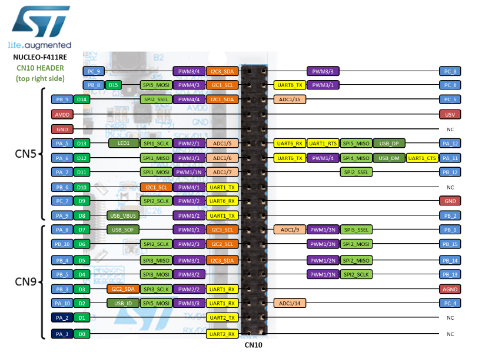
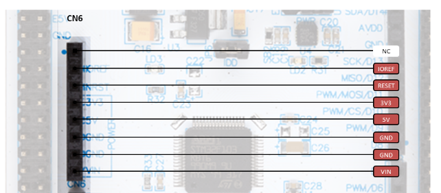

##  Non-Simplicity Studio 5

If you decide to approach project without Simplicity Studio 5, you have to do some setup before working on the project. This approach does not depend on any IDEs. You will do setup in Linux environment and use any code editors to implement your code. Then you will build project using Makefile.
But there is a little more complex if you want to add more software components to your project. You have to modify slcp file and insert component's name manually because it does not have GUI to install components like slcp tool in Simplicity Studio 5.
Follow guidelines below to generate and build project successfully without Simplicity Studio 5.

**Setup development environment**

1. Setup Ubuntu 20.04

2. Update
```
    sudo apt update && sudo apt upgrade -y
```

3. Install dependencies and some build systems
```
    sudo apt install git build-essential gcc-multilib g++-multilib ant make cmake gcovr npm python python3 -y
```

4. Install niceties
```
    sudo apt install wget curl openssh-server cifs-utils vim mc meld bash-completion -y
    sudo snap install --classic code
```

5. Update workspace
```
    sudo chmod 777 /opt
```

6. Get GCC Compiler
```
    mkdir -p /opt/temp && cd /opt/temp
    wget https://developer.arm.com/-/media/Files/downloads/gnu-rm/10-2020q4/gcc-arm-none-eabi-10-2020-q4-major-x86_64-linux.tar.bz2
    tar -vxf gcc-arm-none-eabi-10-2020-q4-major-x86_64-linux.tar.bz2 -C /opt/
    /opt/gcc-arm-none-eabi-10-2020-q4-major/bin/arm-none-eabi-gcc --version
```

7. Get Java 11
```
    mkdir -p /opt/temp && cd /opt/temp
    wget https://corretto.aws/downloads/latest/amazon-corretto-11-x64-linux-jdk.tar.gz
    tar -vxf amazon-corretto-11-x64-linux-jdk.tar.gz -C /opt
    export JAVA_HOME=/opt/amazon-corretto-11.0.17.8.1-linux-x64/
    export JAVA11_HOME=$JAVA_HOME
    java -version
```

8. Install NodeJS
```
    curl -o- https://raw.githubusercontent.com/nvm-sh/nvm/v0.35.3/install.sh | bash
```
Close and reopen your terminal to start using nvm or run the following to use it now:
```
    export NVM_DIR="$HOME/.nvm"
    [ -s "$NVM_DIR/nvm.sh" ] && \. "$NVM_DIR/nvm.sh"
    [ -s "$NVM_DIR/bash_completion" ] && \. "$NVM_DIR/bash_completion"
    nvm --version
    nvm list-remote
    nvm install node
```
To be stable, you can install NodeJS verion 14.15.1
```
    nvm list-remote
    nvm install v14.15.1
    nvm use 14.15.1
    nvm list
```

9.  Build environment
```
    cd /opt
    git clone ssh://git@stash.silabs.com/wmn_tools/silabs-scripts.git
    vim silabs-scripts/silabs.bashr
```
Then add the following line to the top of the file
```
    export GITHUBS_DIR=/opt
    export JAVA_HOME="/opt/amazon-corretto-11.0.17.8.1-linux-x64/"
    export JAVA11_HOME="/opt/amazon-corretto-11.0.17.8.1-linux-x64/"
    export STUDIO_ADAPTER_PACK_PATH=/opt/zap
    export PATH=/opt/uc_cli:/opt/zap:$PATH
    export ARMGCC_DIR="/opt/gcc-arm-none-eabi-10-2020-q4-major"
    export ARM_GCC_DIR="/opt/gcc-arm-none-eabi-10-2020-q4-major"
    export ARM_GNU_DIR="/opt/gcc-arm-none-eabi-10-2020-q4-major"
    export PATH="${JAVA11_HOME}/bin:${PATH}
```
Then escape the file and activate environment by following below line
```
    echo "source /opt/silabs-scripts/silabs.bashrc" >> ~/.bashrc
```

10.   Install Silabs SLC tool
```
    cd /opt
    git clone ssh://git@stash-mirror.silabs.com/stash/simplicity_studio/uc_cli.git
    cd uc_cli
    ./slc
```

11.   Install Silabs ZAP tool
```
    cd /opt
    git clone ssh://git@stash.silabs.com/wmn_tools/zap.git
    cd /opt/zap/
    npm install
    npm run zap --version
```
**Generate and build project**

1. Clone Zigbee Stack porting for 3rd party MCU SDK
```
    cd /opt
    git clone ssh://git@stash.silabs.com/telegesis/devs_zigbee_porting_for_3rd_party_mcu.git
```
Should rename ***devs_zigbee_porting_for_3rd_party_mcu*** to ***gsdk*** for easier use
```
    mv devs_zigbee_porting_for_3rd_party_mcu gsdk
```

2. Add extension to GSDK
```
    cd /opt/gsdk
    git checkout stm/stm32f4xx
    mkdir extension && cd extension
    git clone -b stm/stm32f4xx --single-branch ssh://git@stash.silabs.com/telegesis/devs_zigbee_porting_for_3rd_party_mcu.git
    mv devs_zigbee_porting_for_3rd_party_mcu/zigbee_host_mcu/ ./ && rm -rf devs_zigbee_porting_for_3rd_party_mcu/
    cd .. && git checkout feature/IOT_DS-2007-refactor-project-structure-gsdk-part
```

3. Generate & build project
```
    slc generate -np extension/zigbee_host_mcu/app/framework/scenarios/z3/Z3LightMcu/Z3LightMcu.slcp  -d app/project  -tlcn gcc  --generator-timeout 200 --with="nucleo-f411re;zigbeehostmcu"
    cd app/project
    make -f Z3LightMcu.Makefile -j6
```

## Simplicity Studio 5

Simplicity Studio 5 is a great IDE with many tools which is helpful to reduce a lot of effort in order to use Silabs Zigbee stack on 3rd platform.
Follow guidelines below to generate and build project successfully with Simplicity Studio 5.

**Clone GSDK and extension**

1. Clone Zigbee Stack porting for 3rd party MCU SDK
```
    git clone ssh://git@stash.silabs.com/telegesis/devs_zigbee_porting_for_3rd_party_mcu.git
```
Should rename ***devs_zigbee_porting_for_3rd_party_mcu*** to ***gsdk*** for easier use
```
    mv devs_zigbee_porting_for_3rd_party_mcu gsdk
```
***gsdk*** folder looks like image below.
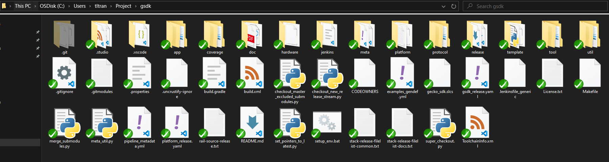

1. Clone extension for SDK

Create a folder name ***extension*** in ***gsdk*** folder. In ***extension*** folder, clone the extension for SDK.
```
    git clone -b stm/stm32f4xx --single-branch ssh://git@stash.silabs.com/telegesis/devs_zigbee_porting_for_3rd_party_mcu.git
```
Move ***zigbee_host_mcu*** folder from ***devs_zigbee_porting_for_3rd_party_mcu*** to ***extension***. Finally, ***extension*** folder looks like image below.
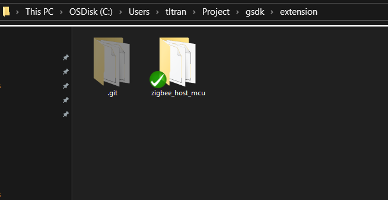

**Generate project in Simplicity Studio 5**

0. [Download Simplicity Studio 5](https://www.silabs.com/developers/simplicity-studio?download=%2Fdocuments%2Flogin%2Fsoftware%2FSimplicityStudio-5.iso%7CSimplicityStudio-5.iso) then install it (Skip this step if you have already installed Simplicity Studio 5)

1. Add SDK and extension to Simplicity Studio 5

* Firstly, go to ***gsdk/extension/zigbee_host_mcu/utilities/stuido5_patch***, activate the host patch by open any bash tool then run command below
```
    sh host_patch.sh
```
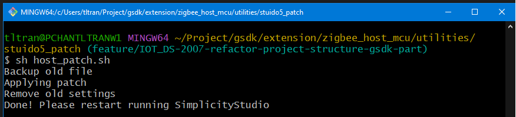
* Open/Restart Simplicity Studio 5, add SDK by select ***Preferences/SDKs/Add SDK***
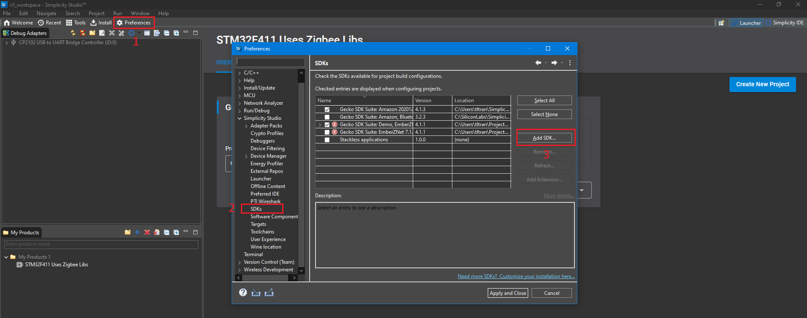
* Browse your ***gsdk*** folder location then select OK
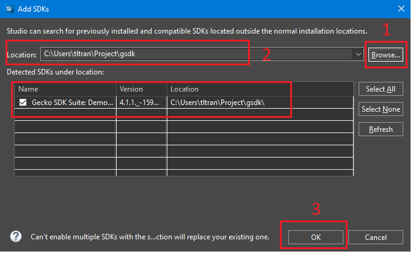
* Select your ***gsdk***. Choose ***Add Extension/Browse***. Browse ***gsdk/extension/zigbee_host_mcu*** location then select OK
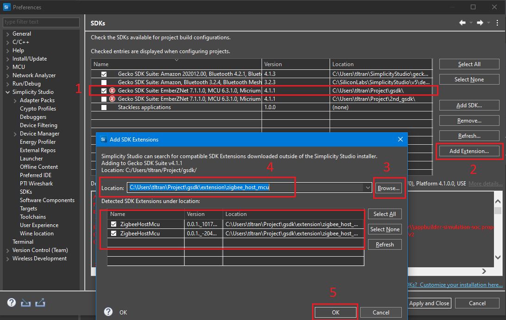

2. Add NUCLEO-F411RE Uses Zigbee Libs product
* Select ***Launcher*** tab. Then click on **+** symbol at ***My Products*** tab
* Find ***nucleo*** in ***Product Name*** then add ***NUCLEO-F411RE Uses Zigbee Libs*** to ***Selected Products***
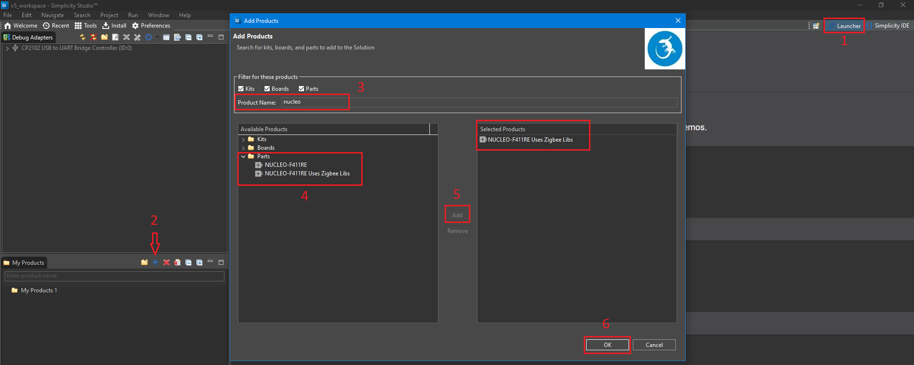

3. Create a project
* Select ***Launcher*** tab. Then select ***NUCLEO-F411RE Uses Zigbee Libs*** product
* Make sure that SDK is selected correctly
* Click on ***Create New Project*** or ***Example Projects & Demos***
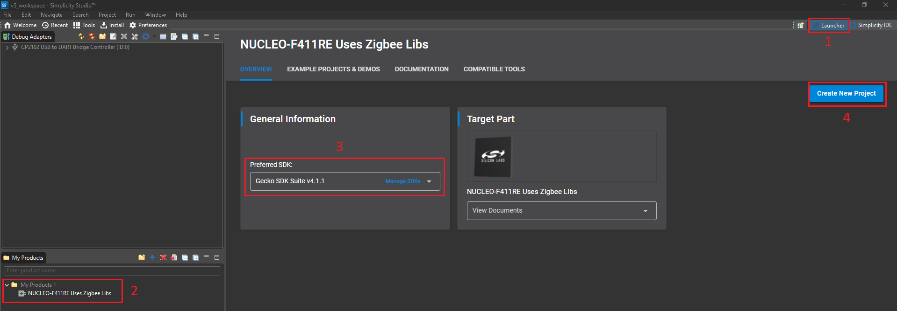
* There are 3 examples which were created for users to use and customize: ***Z3 Light MCU, Z3 Light MCU FreeRTOS, Host ZigbeeMinimalHostMcuRcp***. Let's create ***Z3 Light MCU*** and see how it can be imported, coded and built with 3rd platform
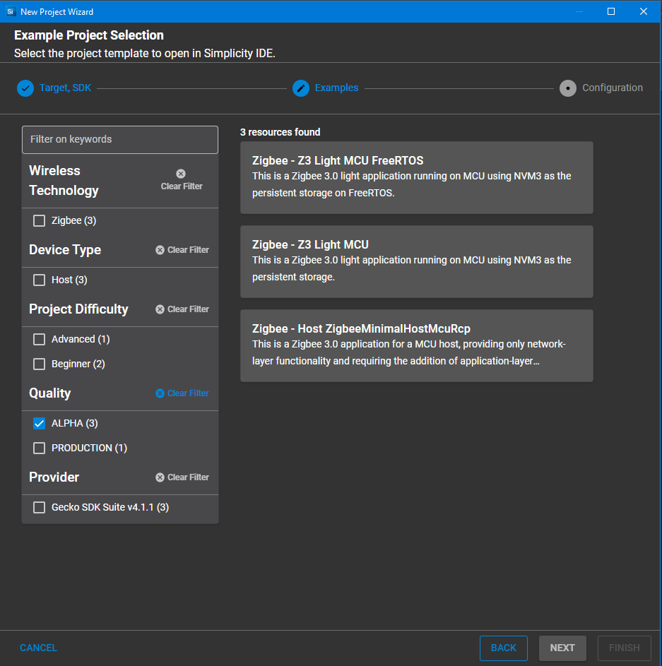

**Import the project and work with 3rd platform**

As mentioned above, at the time this user guide is written, we only support STM32CubeIDE as a 3rd platform.

1. Import the project
* Open STM32CubeIDE, select ***File/Import***. In ***Import tab***, select ***C/C++*** and ***Existing Code as Makefile Project***. Then select Next
* Browse ***Z3 Light Mcu*** location. Select ***MCU ARM GCC*** as a toolchain for indexer settings. Then finish importing.